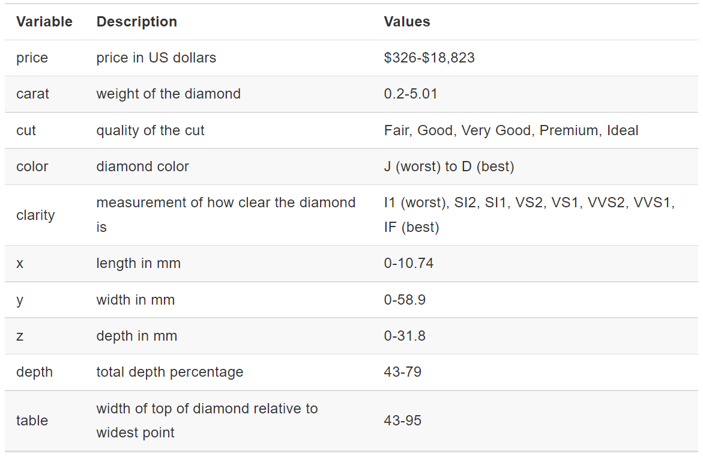

```{r setup}
suppressPackageStartupMessages({
  library(tidyverse)
})
```

## Why ggplot2?

### Advantages of ggplot2
- It's consistent! gg = "grammar of graphics"; easy base system for adding/removing plot elements, with room for being fancy too.
- Very flexible
- Themes available to polish plot appearance
- Active maintenance/development = getting better all the time!
- It can do quick-and-dirty and complex, so you only need one system
- Plots, or whole parts of plots, can be saved as objects
- Easy to add complexity or revert to earlier plot

### Disadvantages of ggplot2
- Difficult to work with in iterated functions
- No 3-D graphics
- Only "graph theory" type graphs
- ggplot is often slower than base graphics
- The default colors can be difficult to change
- You might need to change the structure of your data frame to make certain plots (use tidyr::pivot_wider() and tidyr::pivot_longer())

## First off, install ggplot2
```{r install ggplot2, eval = FALSE}
install.packages("ggplot2")
```

```{r load ggplot2}
library(ggplot2)
```

## Example dataset: Diamonds

{width=50%}

```{R}
head(diamonds)
```
{width=50%}

- The dataset contains information about 53,940 round-cut diamonds

- There are 10 variables measuring various pieces of information about the diamonds.

- There are 3 variables with an ordered factor structure: cut, color, & clarity

## Transitioning from base plotting to `ggplot2`

There are two functions to know: `qplot()` and `ggplot()`.

```{R compare functions}
# load the diamonds dataset
data(diamonds)

plot(diamonds$carat, diamonds$price, main = "I'm a base plot")

qplot(x = carat, y = price, data = diamonds, geom = "point") +
  ggtitle("I'm a qplot")

ggplot(data = diamonds, aes(x = carat, y = price)) + geom_point() +
  ggtitle("I'm a ggplot")

```

### Using `qplot`

`qplot()` is a shortcut that will be familiar to anyone using the `base::plot()`. It's great for making some basic plot types, like scatterplots, boxplots, histograms, and jitter plots, but it doesn't allow for complex plots like ggplot does.
```{r qplot ex}
qplot(carat, price, data = diamonds) +
  labs(title = "Scatterplot of Diamond Carat versus Price",
       x = "Carat", y = "Price")
qplot(carat, price, data = diamonds, color = color) +
  labs(title = "Scatterplot of Diamond Carat versus Price",
       x = "Carat", y = "Price",
       subtitle = "With Diamond Color")
qplot(carat, price, data = diamonds, size = color, color = color) +
  labs(title = "Scatterplot of Diamond Carat versus Price",
       x = "Carat", y = "Price",
       subtitle = "With Diamond Color")
qplot(carat, price, data = diamonds, facets = clarity ~ color) +
  labs(title = "Scatterplot of Diamond Carat versus Price",
       x = "Carat", y = "Price",
       subtitle = "Separated by Clarity and Color")
```

Here, we add a theme:
```{r qplot ex 2}
mod <- lm(price ~ carat + color + clarity, data = diamonds)
qplot(resid(mod), fitted(mod),
      main = "Residuals vs. Fitted Values") + 
  theme_classic() +
  labs(x = "Residuals", y = "Fitted Values")
```

```{r qplot geoms}
set.seed(92)
# Use different geoms
qplot(carat, price, data = diamonds, geom = "path") +
  labs(title = "Path plot of carat versus price",
       x = "Carat", y = "Price")

# For illustration purposes, use only a subset of the data
diamonds_sub <- diamonds[sample(size = 400, x = nrow(diamonds)), ]
qplot(clarity, price, data = diamonds_sub,
      geom = c("boxplot", "jitter")) +
  labs(title = "Jittered Boxplot of clarity versus price",
       x = "Clarity", y = "Price")
qplot(clarity, data = diamonds_sub,
      geom = "dotplot") +
  labs(title = "Dotplot of diamond clarity",
       x = "Clarity")
```

## Using `ggplot2` for more complex plots

Use facet_grid() or facet_wrap() to create a separate plot for each value of a factor variable. We don’t have to change any of the original plotting code, just add the facet command to it. Faceting can also be done on more than one categorical variable to create a grid of plots.
```{r}
# make the basis for a plot using ggplot save it as an object, p
p <- ggplot(data = diamonds, aes(x = carat, y = price))
# add a geom (points) and display the plot
p + geom_point() + facet_grid(. ~ color, labeller = label_both) +
  labs(x = "Carat", y = "Price", title = "Carat versus price, separated by color")
```

### Multivariate Exploration using Colors and Facet

```{r ggplot colors}
# color by a continuous variable
ggplot(data = diamonds, aes(x = carat, y = price, color = depth)) + 
  geom_point() 
# color by a factor variable
ggplot(data = diamonds, aes(x = carat, y = price, color = color)) + 
  geom_point()
```


### Building plots in layers

Sometimes, it is helpful to save a simpler version of a plot, and then add onto it later with additional layers (for example, an if/else statement that plots different layers dependent on if a criterion is met or not).

We might want to summarize the data in the previous plot with a smoother on top of the points. With ggplot, we can simply add the geom_smooth command. Each geom just adds another layer to the plot.

```{R}
ggplot(data = diamonds, aes(x = carat, y = price, color = clarity)) +
  geom_point(alpha = 0.1) + geom_smooth()

```

#### Making a layered histogram

A layered histogram is a great way to compare the distribution of a variable across groups. `geom_histogram` works well for two groups, but geom_density is easier to look at for several groups.

```{r}
ggplot(data = diamonds, aes(x = price, fill = cut)) +
  geom_density(alpha = 0.3)
```

## Further Resources & Assistance

- Cheat sheet for data visualization with ggplot2 (accessible in Rstudio by going to Help -> Cheat Sheets -> Data visualization with ggplot2)
- ggplot2 documentation
- Google
- Stack overflow
- Hadley Wickham's book https://ggplot2-book.org/


